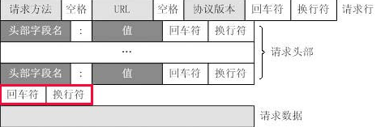

# http报文格式

* 请求行
    - 范例：GET /index.html HTTP/1.1
    - 请求方法：GET、POST、HEAD、PUT、DELETE、OPTIONS、TRACE、CONNECT
        + GET：当客户端从服务端读取文档时使用GET方法，使用GET方法时，请求参数和对应的值附加到URL后，利用一个问号（“？”）代表URL的结束与请求参数的开始，传递参数的最长为1024个字节
        + POST：当客户端向服务端提交的信息较多时使用POST方法，POST方法将参数和值封装在请求的数据中国，以键值对的形式出现
* 请求头
    - 请求头部由关键字/值对组成，每行一对。关键字与值使用英文冒号分割。请求头部通知服务器关于客户端请求的信息。
    - 典型的请求头有：
        + User-agent：产生请求的浏览器类型
        + Accept：客户端可识别的内容类型列表
        + Host：请求的主机名，允许多个域名同处一个ip地址，即为虚拟主机。
* 空行
    - 最后一个请求头之后是一个空行，发送回车和换行符，通知服务器一下不再有请求头
    - 对于一个完整的http请求来说，空行是必须的，否则服务器会认为本次请求的数据尚未完全发送到服务器，服务器会一直处于等待状态。
* 请求数据
    - 请求数据不在GET方法中，而是在POST方法中
    - POST方法适用于需要客户填写表单的场合
    - 与请求数据相关的最常用的请求头有Content-Type和Content-Length

# GET与POST
* GET是从服务器上获取数据，POST是向服务器传送数据
* 对于GET方式，服务端使用Request.QueryString获取变量的值；POST方式服务端使用Request.Form获取提交的数据
* GET方式通过URL提交数据，数据在URL中可以看到，所以不安全；POST方式，数据放在html header中，较为安全。
* GET方式提交的数据最多为1024字节，POST方式则没有限制。
