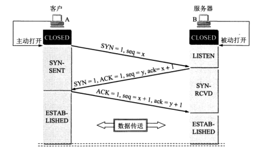
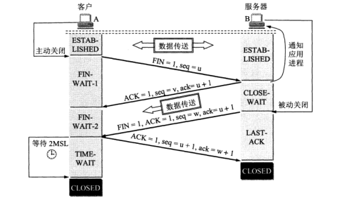
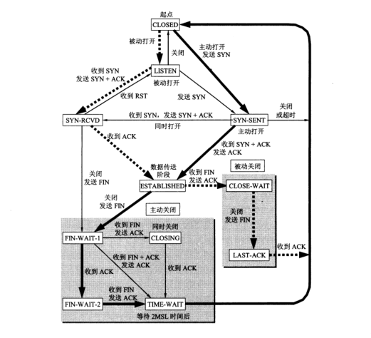

# 建立连接
>三次握手

# 释放连接
>四次挥手

# 状态迁移
## 客户端状态迁移
* CLOSED   连接关闭
* SYN_SENT   主动发送连接请求【SYN】，等待确认
* ESTABLISHED  socket已经处于链接状态，可以进行数据交互
    - 一般认为一个established就是一个服务的并发连接
* FIN_WAIT1     要求关闭连接【FIN】，但请求未被确认
* FIN_WAIT2     要求关闭连接的请求被确认【ACK】
    - 此时为半连接，可以接收数据单不能发送数据
* TIME_WAIT     收到关闭半连接的请求【FIN】，发送确认信息【ACK】
    - 超时【2MSL(maximum segment lifetime)数据包最大生存时间】后连接被释放
* CLOSED   连接关闭

## 服务端状态迁移
* CLOSED   连接关闭
* LISTEN        监听状态，等待连接请求
* SYN_RECVD  被动收到连接请求后，发送确认信息【ACK】，状态改变
* ESTABLISHED  socket已经处于链接状态，可以进行数据交互
* CLOSE_WAIT        收到关闭连接的请求【FIN】，发送确认信息【ACK】
* LAST_ACK      要求关闭半连接【FIN】，但请求未被确认
* CLOSED   收到连接关闭的确认信息【ACK】，连接关闭

# CLOSING状态
* 原因：两端同时要求关闭连接
    - 已发出关闭请求【FIN】，但未收到对此的确认信息
    - 同时，收到对端的关闭请求【FIN】，发出确认信息【ACK】
* 邻接状态
    - FIN_WAIT1     要求关闭连接【FIN】，但请求未被确认
    - CLOSING     同时发出关闭连接请求【ACK】，但未收到确认信息
    - TIME_WAIT     收到发送关闭连接的确认信息【ACK】

# 有限状态机

# TCP参数
* tcp_syn_retries：对于一个新建连接，内核要发送多少个 SYN 连接请求才决定放弃。不应该大于255，默认值是5，对应于180秒左右时间。(对于大负载而物理通信良好的网络而言,这个值偏高,可修改为2.这个值仅仅是针对对外的连接）
* tcp_retries1：放弃回应一个TCP连接请求前﹐需要进行多少次重试。默认值是3
* tcp_synack_retries：对于远端的连接请求SYN，内核会发送SYN ＋ ACK数据报，以确认收到上一个 SYN连接请求包。这是所谓的三次握手( threeway handshake)机制的第二个步骤。这里决定内核在放弃连接之前所送出的 SYN+ACK 数目。不应该大于255，默认值是5，对应于180秒左右时间。(可以根据上面的 tcp_syn_retries 来决定这个值)
* tcp_syncookies：当出现syn等候队列出现溢出时象对方发送syncookies。目的是为了防止syn flood攻击。
* tcp_max_syn_backlog：对于那些依然还未获得客户端确认的连接请求﹐需要保存在队列中最大数目。对于超过 128Mb 内存的系统﹐默认值是 1024 ﹐低于 128Mb 的则为 128。如果服务器经常出现过载﹐可以尝试增加这个数字。
* tcp_abort_on_overflow：当守护进程太忙而不能接受新的连接，就向对方发送reset消息，默认值是false。这意味着当溢出的原因是因为一个偶然的猝发，那么连接将恢复状态。只有在你确信守护进程真的不能完成连接请求时才打开该选项，该选项会影响客户的使用。(对待已经满载的sendmail,apache这类服务的时候,这个可以很快让客户端终止连接,可以给予服务程序处理已有连接的缓冲机会,所以很多防火墙上推荐打开它)
* tcp_max_tw_buckets：系 统在同时所处理的最大 timewait sockets 数目。如果超过此数的话﹐time-wait socket 会被立即砍除并且显示警告信息。之所以要设定这个限制﹐纯粹为了抵御那些简单的 DoS 攻击﹐(事实上做NAT的时候最好可以适当地增加该值)
* tcp_tw_recycle：打开快速 TIME-WAIT sockets 回收。(做NAT的时候，建议打开它)
* tcp_tw_reuse：该文件表示是否允许重新应用处于TIME-WAIT状态的socket用于新的TCP连接(这个对快速重启动某些服务,而启动后提示端口已经被使用的情形非常有帮助)
* tcp_timestamps：Timestamps 用在其它一些东西中﹐可以防范那些伪造的 sequence 号码。
* tcp_max_orphans：系统所能处理不属于任何进程的TCP sockets最大数量。假如超过这个数量﹐那么不属于任何进程的连接会被立即reset，并同时显示警告信息。之所以要设定这个限制﹐纯粹为了抵御那些简单的 DoS 攻击﹐
* tcp_fin_timeout ：对于本端断开的socket连接，TCP保持在FIN-WAIT-2状态的时间。对方可能会断开连接或一直不结束连接或不可预料的进程死亡。默认值为 60 秒。
* tcp_keepalive_time：当keepalive打开的情况下，TCP发送keepalive消息的频率。默认值是7200(2小时)
* tcp_keepalive_probes：TCP发送keepalive探测以确定该连接已经断开的次数。默认值是9
* tcp_keepalive_intvl：探测消息发送的频率，乘以tcp_keepalive_probes就得到对于从开始探测以来没有响应的连接杀除的时间。默认值为75秒，也就是没有活动的连接将在大约11分钟以后将被丢弃。(对于普通应用来说,这个值有一些偏大,可以根据需要改小.特别是web类服务器需要改小该值,15是个比较合适的值)

# 常见问题
* SYN超时或syn攻击防御
    - tcp_syncookies
    - tcp_synack_retries
    - tcp_max_syn_backlog
    - tcp_abort_on_overflow
* TIME_WAIT处理
    - TIME_WAIT快速回收
        + tcp_tw_recycle
        + tcp_timestamps
    - TIME_WAIT重用
        + tcp_tw_reuse
        + tcp_timestamps
    - tcp_max_tw_buckets：控制并发的TIME_WAIT数量

# 参考
* [tcp_syn_retries等参数详解][1]
* [浅析TCP协议中的疑难杂症][2]

[1]: https://blog.csdn.net/zhangxinrun/article/details/7621028
[2]: https://blog.csdn.net/changyourmind/article/details/53127100

