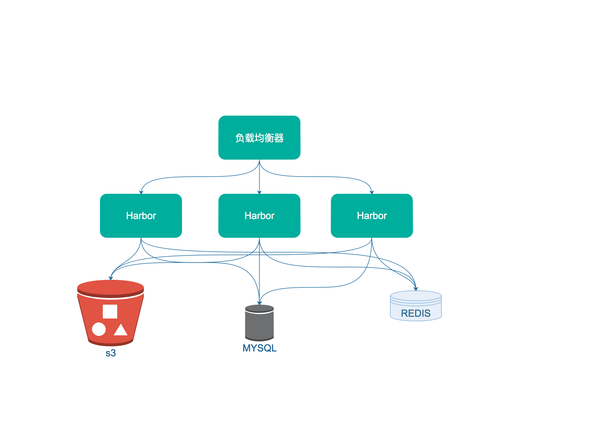

# harbor架构
>[参考源][5]
## 存储
* 镜像的存储harbor使用的是官方的docker registry服务去完成；至于registry是用本地存储或者s3都是可以的，harbor的功能是在此之上提供用户权限管理、镜像复制等功能
* harbor镜像的复制是通过docker registry 的API去拷贝
## 架构

* 主要组件包括proxy，他是一个nginx前端代理，主要是分发前端页面ui访问和镜像上传和下载流量，上图中通过深蓝色先标识；
* ui提供了一个web管理页面，当然还包括了一个前端页面和后端API，底层使用mysql数据库；
* registry是镜像仓库，负责存储镜像文件，当镜像上传完毕后通过hook通知ui创建repository，上图通过红色线标识，当然registry的token认证也是通过ui组件完成；
* adminserver是系统的配置管理中心附带检查存储用量，ui和jobserver启动时候回需要加载adminserver的配置，通过灰色线标识；
* jobsevice是负责镜像复制工作的，他和registry通信，从一个registry pull镜像然后push到另一个registry，并记录job_log，上图通过紫色线标识；
* log是日志汇总组件，通过docker的log-driver把日志汇总到一起，通过浅蓝色线条标识。

## harbor使用
### 用户管理
* 用户分为三种角色：项目管理员（MDRWS）、开发人员（RWS）和访客（RS），当然还有一个最高管理员权限admin系统管理员。 
* M:管理、D:删除、R:读取、W:写入、S:查询

### 项目管理
项目管理是系统最主要的一个功能模块，项目是一组镜像仓库的逻辑集合，是权限管理和资源管理的单元划分。一个项目下面有多个镜像仓库，并且关联多个不同角色的成员，镜像复制也是基于项目的，通过添加复制规则，可以将项目下面的镜像从一个harbor迁移到另一个harbor，并且可以通过日志查看复制过程，并有retry机制。

### 配置管理和日志查询
* 配置管理主要是配置harbor的认证模式，企业内部使用，通常都是对接到公司LDAP上面，当然harbor也支持数据库认证；还可以设置token的有效时间。用户对镜像的pull和push操作都可以被harbor记录下来，这样为排查文件提供了重要手段。 
* 当然harbor功能不止我上面说的，譬如harbor集成了clair镜像扫描功能，它是cereos开发的一款漏洞扫描工具，可以检查镜像操作系统以及上面安装包是否与已知不安全的包版本相匹配，从而提高镜像安全性

### harbor高可用

# 安装
>[安装参考][6]

* 安装条件
    - python：2.7及以上
    - docker：[安装参考][1]
    - docker-compose：[安装参考][2]
* [下载离线安装包][3]
* 参数配置
    - hostname = reg.mydomain.com
    - db_password = root123
* hostname配置要点
    - 当配置hostname为内网地址时，虽然登陆地址可以通过地址映射使用外网地址；但是认证时，服务端回传客户端的认证地址，依然是内网地址造成无法登陆认证。
    - 当配置hostname为外网地址时，由于外网带宽限制，内网服务器不能高速的进行镜像传输
    - 当配置hostname为域名时，采用dns分离解析，内网dns解析使用自定义dns并解析为内网地址，外网dns解析使用公网dns并解析为公网ip。
* 存储位置调整
    - harbor镜像存储-registry
    - mysql数据存储-mysql
    - harbor镜像存储容量显示-adminserver：/data:/data:z
* harbor启动
    - 包装命令：sudo ./install.sh
* web访问
    - 地址：http://ip:80
    - 认证：admin/Harbor12345【默认，可在harbor.cfg中配置】

# docker-compose命令
* docker-compose up -d 创建和启动容器【后台】
* docker-compose down 停止和删除容器
* docker-compose start 启动容器及服务
* docker-compose stop 停止容器及服务

# 仓库使用
* 登陆：docker login -u username -p password reg.mydomain.com
* 上传镜像
    - docker tag SOURCE_IMAGE[:TAG] harbor.zj-hf.cn/mytest/IMAGE[:TAG]
    - docker push harbor.zj-hf.cn/mytest/IMAGE[:TAG]
* 下载镜像
    - docker login
    - docker pull harbor.zj-hf.cn/mytest/registry:latest
* 删除镜像
    - web界面删除镜像
    - 后台删除【需要暂停harbor使用】
        + 停止harbor：docker-compose stop
        + 测试删除：docker run -it --name gc --rm --volumes-from registry vmware/registry:2.6.2-photon garbage-collect --dry-run /etc/registry/config.yml【dry-run参数只显示服务将执行的动作】
        + 删除镜像：docker run -it --name gc --rm --volumes-from registry vmware/registry:2.6.2-photon garbage-collect  /etc/registry/config.yml
        + 启动harbor：docker-compose start

# 仓库其他功能
>[管理参考][4]
## 管理
* 默认开启自注册功能【但是密码重置功能需要设置邮件参数】
* 项目可以设置公开或私有，公开项目读写无需登录认证，私有项目读写需要认证
* 新建项目默认自己为管理员，可以添加其他成员为开发者【可以上传或下载镜像】或访问者【只能下载镜像】
* 非系统管理员用户登录，只能看到有权限的项目和日志
* 用户创建项目权限控制，默认是everyone（所有人），也可以设置为adminonly（只能管理员）

[1]:https://yq.aliyun.com/articles/110806
[2]: https://docs.docker.com/compose/install/
[3]: https://github.com/vmware/harbor/releases
[4]: https://github.com/vmware/harbor/blob/master/docs/user_guide.md
[5]: http://blog.csdn.net/u010278923/article/details/77941995
[6]: https://github.com/vmware/harbor/blob/master/docs/installation_guide.md
